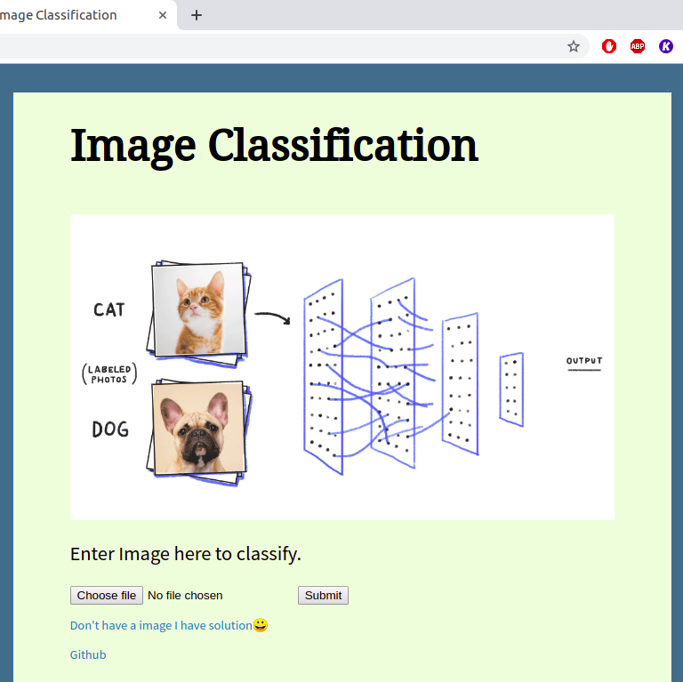
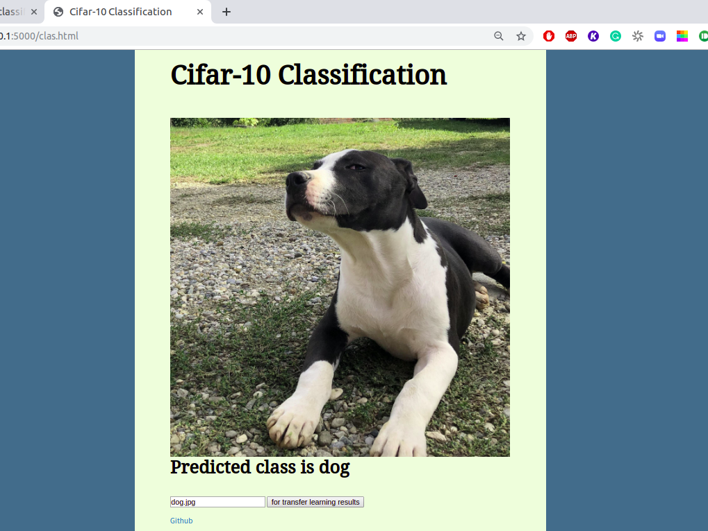

# Simple Flask App

Cifar10 CNN ACC ~ 0.7 
Cifar10 VGG16 transfer learning ACC ~ 0.8 

# Demo

# use

clone repo. 
download weights from <a href = 'https://drive.google.com/open?id=1eMjRwzuAZpKhF2qetmBWMwLHZ78Te7pa'> here</a>. put it in folder 'models' (create it in main folder) 
run main.py
